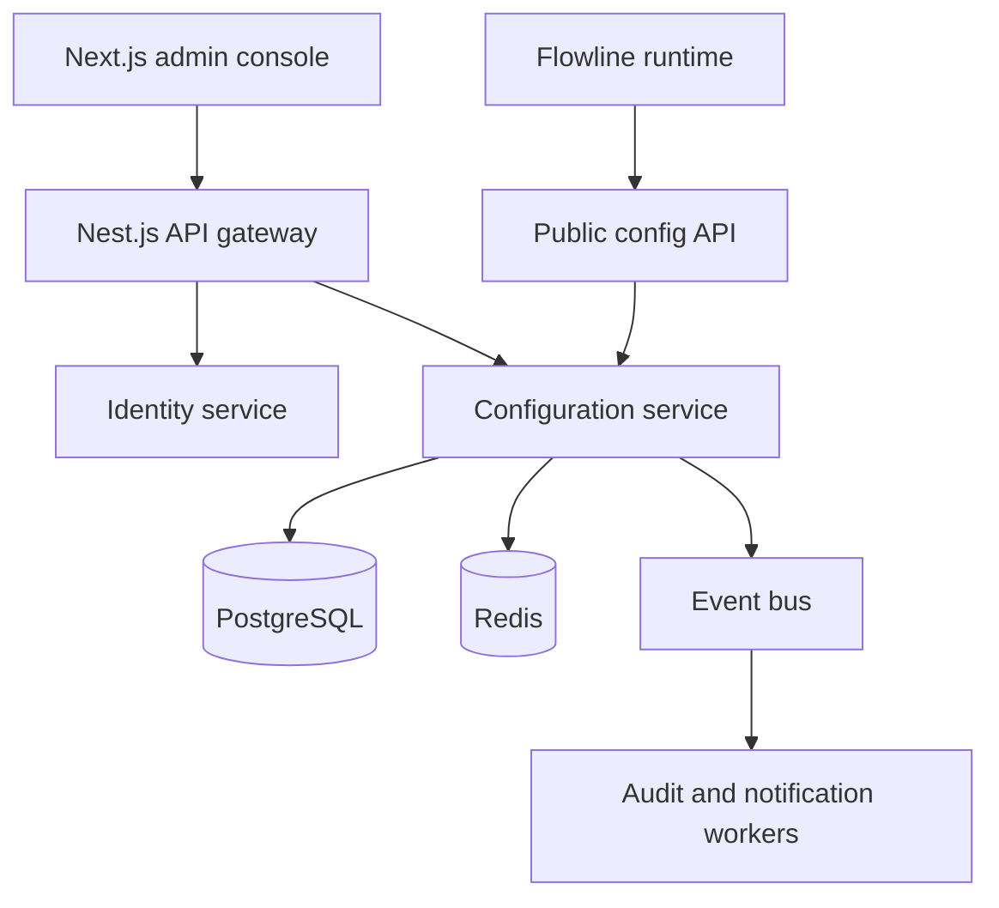

# Architecture

## High-level topology



## Why this structure

### Next.js admin console

The browser UI owns routes, forms, tables, loading states and error states. It never becomes the source of truth for permissions or publishing rules.

### Nest.js API gateway

The gateway is the stable HTTP entry point for the web client. It will handle authentication, authorization and API composition while hiding internal service addresses from the browser.

### Identity service

This service owns registration, password hashing, sessions/tokens, user profile and workspace membership. Keeping identity separate makes authorization rules explicit. A workspace is the tenant boundary: configuration queries are scoped to the workspace attached to the authenticated request.

### Configuration service

This bounded context owns parameter schema, drafts, versions, validation, publish, rollback and active runtime values. It is the only service allowed to mutate configuration data.

### Public config API

The customer-facing Flowline service reads a small, cacheable runtime snapshot. The read path is intentionally different from the admin write path: it needs low latency, a stable payload and rate limiting.

### Event bus and workers

Audit fan-out, notifications and analytics should not block a user waiting for a publish response. The configuration service emits events; workers process them asynchronously and must be idempotent.

## First implementation boundary

The first vertical slice contains one Nest.js `config-api` service and one Next.js app. The service boundary is already visible in the repository, but we will extract identity, notifications and workers only when their domain contracts are clear. This avoids decorative microservices and teaches why a boundary exists.

## Deployment target

Locally, PostgreSQL and Redis run in Docker Compose. In AWS, the target is ECS/Fargate behind an Application Load Balancer, PostgreSQL in RDS, object storage in S3, events through SNS/SQS, logs in CloudWatch and all infrastructure in Terraform.

We do not add Kubernetes just to say «microservices». ECS/Fargate provides containers, health checks, rolling deployments, IAM and autoscaling with less operational overhead for this portfolio project.
## Authentication boundary

The browser never talks directly to PostgreSQL. It calls the Nest.js API. Registration and login create an httpOnly JWT cookie; the API's `JwtAuthGuard` verifies that cookie before allowing private configuration operations. The health endpoint and future runtime snapshot remain separate public endpoints.

```text
Next.js UI -> Nest.js AuthController -> bcrypt/User table
Next.js UI -> cookie -> JwtAuthGuard -> ConfigsController -> Prisma -> PostgreSQL
```

Private configuration routes use two guards in sequence:

```text
JWT cookie -> JwtAuthGuard -> user + workspace -> WorkspaceRoleGuard -> endpoint
```

`JwtAuthGuard` answers «who is making this request?». `WorkspaceRoleGuard` answers «is this user's role allowed to perform this action?». The browser may hide controls for read-only roles, but the API remains the authoritative security boundary.


## Safe configuration write path

Configuration writes now use a versioned workflow instead of directly overwriting the runtime value:

```text
Editor -> DRAFT -> PENDING_APPROVAL
Approver -> APPROVED / REJECTED
Owner/Admin -> PUBLISHED
Previous PUBLISHED -> ARCHIVED
```

`ConfigEntry` is the stable identity of a parameter and stores the currently published runtime value. `ConfigRevision` stores proposed and historical versions. Publishing runs inside one PostgreSQL transaction so archiving the old revision, activating the approved value and writing the audit event either all succeed or all roll back together.

The audit log is append-only through the application API. It records the actor, action, target configuration, timestamps and before/after snapshots for important workflow transitions.
